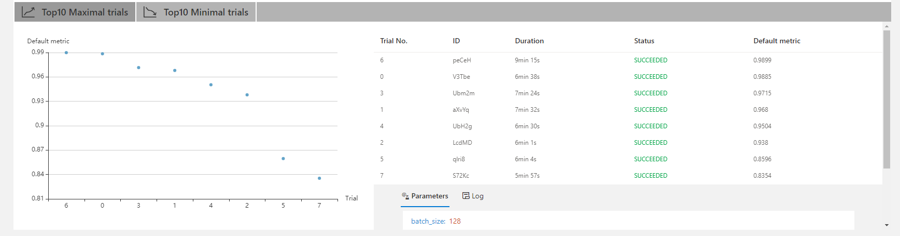
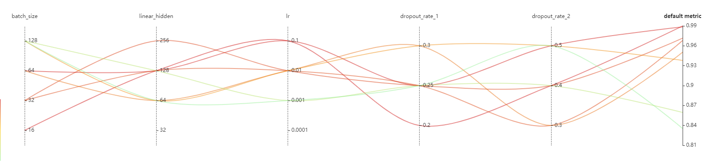
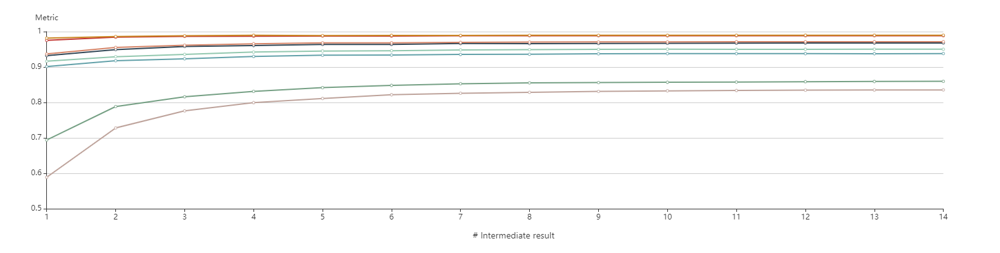

# Task 1.1 样例分析文档
## 1. 总体结果
我们在实验中将时长设定为1h，在1h的时间内总共完成了8次trial，其中最高的准确率达到了0.9899，最低为0.8354，平均运行时间约为6分钟。详情如图所示<br>

## 2. 每个超参对模型效果的影响分析

从上图可以发现，对模型影响最大的两个超参数是batch_size和learning rate。当batch_size=128或者lr=0.001/0.0001时模型效果都比较差，这表明我们在使用此模型时应当选择小一点的batch_size和不要太小的学习率（当然，由于只在1小时内跑了8个trial，且每个模型的最大epoch只有14个，选择这些超参数效果较差的原因很可能是模型还没有收敛造成的）。本次实验搜索到的最优的超参组合为batch_size=64,linear_hidden=128,lr=0.1,dropout_rate_1=0.25,dropout_rate_2=0.5,最佳的准确率为0.9885
## 过拟合情况

从上图发现，在14个epoch中，每种超参组合均没有发生明显的过拟合现象。
## 3. 源代码
mnist/config.yml
```
authorName: pyboys
experimentName: example_mnist_pytorch_with_nni
trialConcurrency: 1
maxExecDuration: 1h
maxTrialNum: 100
#choice: local, remote, pai
trainingServicePlatform: local
searchSpacePath: search_space.json
#choice: true, false
useAnnotation: false
tuner:
  #choice: TPE, Random, Anneal, Evolution, BatchTuner, MetisTuner, GPTuner
  #SMAC (SMAC should be installed through nnictl)
  builtinTunerName: TPE
  classArgs:
    #choice: maximize, minimize
    optimize_mode: maximize
trial:
  command: python main.py
  codeDir: .
  gpuNum: 1
```
mnist/search_space.json
```
{
    "batch_size": {"_type":"choice", "_value": [16, 32, 64, 128]},
    "linear_hidden":{"_type":"choice","_value":[32, 64, 128, 256]},
    "lr":{"_type":"choice","_value":[0.0001, 0.001, 0.01, 0.1]},
    "dropout_rate_1":{"_type":"choice","_value":[0.2, 0.25, 0.3]},
    "dropout_rate_2":{"_type":"choice","_value":[0.3, 0.4, 0.5]}
}
```
mnist/main.py
```
from __future__ import print_function
import argparse
import nni
import torch
import torch.nn as nn
import torch.nn.functional as F
import torch.optim as optim
from torchvision import datasets, transforms
from torch.optim.lr_scheduler import StepLR


class Net(nn.Module):
    def __init__(self, linear_hidden, dropout_rate_1, dropout_rate_2):
        super(Net, self).__init__()
        self.conv1 = nn.Conv2d(1, 32, 3, 1)
        self.conv2 = nn.Conv2d(32, 64, 3, 1)
        self.dropout1 = nn.Dropout2d(dropout_rate_1)
        self.dropout2 = nn.Dropout2d(dropout_rate_1)
        self.fc1 = nn.Linear(9216, linear_hidden)
        self.fc2 = nn.Linear(linear_hidden, 10)

    def forward(self, x):
        x = self.conv1(x)
        x = F.relu(x)
        x = self.conv2(x)
        x = F.relu(x)
        x = F.max_pool2d(x, 2)
        x = self.dropout1(x)
        x = torch.flatten(x, 1)
        x = self.fc1(x)
        x = F.relu(x)
        x = self.dropout2(x)
        x = self.fc2(x)
        output = F.log_softmax(x, dim=1)
        return output


def train(args, model, device, train_loader, optimizer, epoch):
    model.train()
    for batch_idx, (data, target) in enumerate(train_loader):
        data, target = data.to(device), target.to(device)
        optimizer.zero_grad()
        output = model(data)
        loss = F.nll_loss(output, target)
        loss.backward()
        optimizer.step()
        if batch_idx % args.log_interval == 0:
            print('Train Epoch: {} [{}/{} ({:.0f}%)]\tLoss: {:.6f}'.format(
                epoch, batch_idx * len(data), len(train_loader.dataset),
                100. * batch_idx / len(train_loader), loss.item()))


def test(model, device, test_loader):
    model.eval()
    test_loss = 0
    correct = 0
    with torch.no_grad():
        for data, target in test_loader:
            data, target = data.to(device), target.to(device)
            output = model(data)
            test_loss += F.nll_loss(output, target, reduction='sum').item()  # sum up batch loss
            pred = output.argmax(dim=1, keepdim=True)  # get the index of the max log-probability
            correct += pred.eq(target.view_as(pred)).sum().item()

    test_loss /= len(test_loader.dataset)

    print('\nTest set: Average loss: {:.4f}, Accuracy: {}/{} ({:.0f}%)\n'.format(
        test_loss, correct, len(test_loader.dataset),
        100. * correct / len(test_loader.dataset)))

    return correct / len(test_loader.dataset)


def main():
    # Training settings
    parser = argparse.ArgumentParser(description='PyTorch MNIST Example')
    parser.add_argument('--batch-size', type=int, default=64, metavar='N',
                        help='input batch size for training (default: 64)')
    parser.add_argument('--test-batch-size', type=int, default=1000, metavar='N',
                        help='input batch size for testing (default: 1000)')
    parser.add_argument('--linear_hidden', type=int, default=128, metavar='N',
                        help='hidden size of linear layers')
    parser.add_argument('--dropout_rate_1', type=float, default=0.25, metavar='N',
                        help='dropout rate of the first dropout layer')
    parser.add_argument('--dropout_rate_2', type=float, default=0.5, metavar='N',
                        help='dropout rate of the seconde dropout layer')
    parser.add_argument('--epochs', type=int, default=14, metavar='N',
                        help='number of epochs to train (default: 14)')
    parser.add_argument('--lr', type=float, default=1.0, metavar='LR',
                        help='learning rate (default: 1.0)')
    parser.add_argument('--gamma', type=float, default=0.7, metavar='M',
                        help='Learning rate step gamma (default: 0.7)')
    parser.add_argument('--no-cuda', action='store_true', default=False,
                        help='disables CUDA training')
    parser.add_argument('--seed', type=int, default=1, metavar='S',
                        help='random seed (default: 1)')
    parser.add_argument('--log-interval', type=int, default=10, metavar='N',
                        help='how many batches to wait before logging training status')

    parser.add_argument('--save-model', action='store_true', default=False,
                        help='For Saving the current Model')
    args = parser.parse_args()

    tuner_params = nni.get_next_parameter()
    args.batch_size = tuner_params['batch_size']
    args.lr = tuner_params['lr']
    args.linear_hidden = tuner_params['linear_hidden']
    args.dropout_rate_1 = tuner_params['dropout_rate_1']
    args.dropout_rate_2 = tuner_params['dropout_rate_2']

    use_cuda = not args.no_cuda and torch.cuda.is_available()

    torch.manual_seed(args.seed)

    device = torch.device("cuda" if use_cuda else "cpu")

    kwargs = {'num_workers': 1, 'pin_memory': True} if use_cuda else {}
    train_loader = torch.utils.data.DataLoader(
        datasets.MNIST('../data', train=True, download=True,
                       transform=transforms.Compose([
                           transforms.ToTensor(),
                           transforms.Normalize((0.1307,), (0.3081,))
                       ])),
        batch_size=args.batch_size, shuffle=True, **kwargs)
    test_loader = torch.utils.data.DataLoader(
        datasets.MNIST('../data', train=False, transform=transforms.Compose([
                           transforms.ToTensor(),
                           transforms.Normalize((0.1307,), (0.3081,))
                       ])),
        batch_size=args.test_batch_size, shuffle=True, **kwargs)

    # model = Net().to(device)
    model = Net(args.linear_hidden, args.dropout_rate_1, args.dropout_rate_2).to(device)
    optimizer = optim.Adadelta(model.parameters(), lr=args.lr)

    scheduler = StepLR(optimizer, step_size=1, gamma=args.gamma)
    best_test_acc = 0
    for epoch in range(1, args.epochs + 1):
        train(args, model, device, train_loader, optimizer, epoch)
        current_test_acc = test(model, device, test_loader)

        # report current result
        nni.report_intermediate_result(current_test_acc)
        if current_test_acc > best_test_acc:
            best_test_acc = current_test_acc
        scheduler.step()

    # report final (best) result
    nni.report_final_result(best_test_acc)
    if args.save_model:
        torch.save(model.state_dict(), "mnist_cnn.pt")


if __name__ == '__main__':
    main()

```

