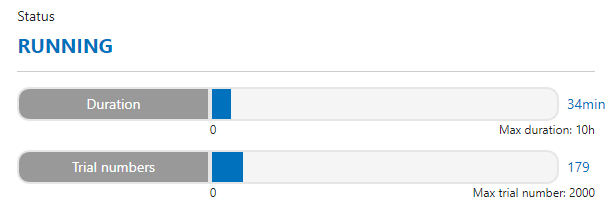
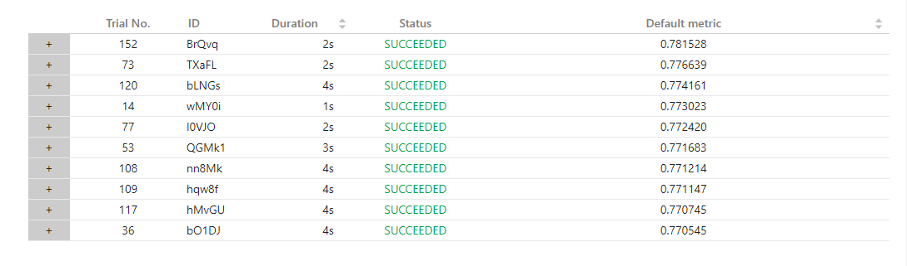
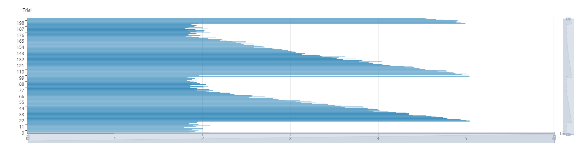
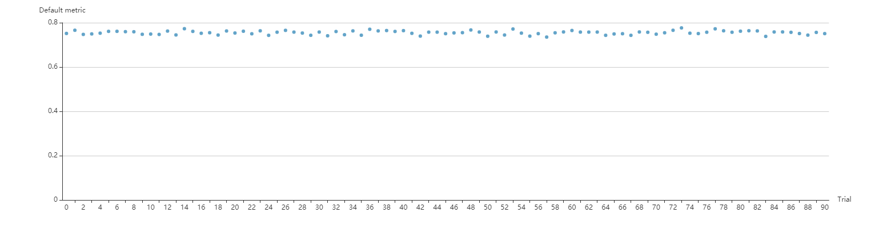

# Task 1.3.1 NNI Feature Engineering 任务1
## 队伍：pyboys
## 1. 样例概述
该样例是PAKDD AutoML第二名的特征工程部分。该样例尝试对数据中的特征进行一阶变换（如count encoding，target encoding，embedding encoding等）和二阶变换（如crosscount encoding等）来生成新特征，结果表明在样例数据集（train.tiny.csv）中通过特征工程在baseline的基础上auc提升了约%2~%3。
## 2. 环境配置
由于该样例创建的时间比较早，有些库如pandas、numpy等使用的是较早版本的api，在配置环境时我们发现代码中使用的api已经被废弃，导致实验运行不成功。为了成功运行样例，需要把pandas降级到0.19及以下，把numpy降级到1.17及以下。对项目中的requirments.txt作如下修改：
```
lightgbm
#pandas
pandas==0.19.2  
#numpy
numpy==1.17.0
sklearn
nni==0.9.1
gensim
```
在指定了pandas和numpy的版本，配置环境并启动项目：
```
cd ~ && git clone https://github.com/SpongebBob/tabular_automl_NNI.git
pip install -r requirments.txt
nnictl create --config config.yml
```
## 3. 样例结果分析
我们总共跑了34分钟实验，179个trail<br>

top10的trial结果如下

从上图可以看到，最佳的metric达到了0.781528，对比baseline（第一个trial）的0.751658提升了约3%。最佳的参数组合（除原特征之外）为：
```
0:"crosscount_C1_C23"
1:"crosscount_C22_C24"
2:"crosscount_C11_C19"
3:"aggregate_var_I9_C11"
4:"aggregate_min_I10_C6"
5:"aggregate_max_I10_C11"
6:"crosscount_C14_C23"
7:"aggregate_max_I9_C20"
8:"crosscount_C11_C17"
9:"crosscount_C1_C12"
10:"aggregate_var_I12_C16"
11:"aggregate_max_I10_C18"
12:"aggregate_max_I11_C19"
13:"crosscount_C24_C7"
14:"crosscount_C11_C17"
15:"crosscount_C13_C17"
16:"aggregate_var_I11_C4"
17:"aggregate_median_I11_C15"
18:"aggregate_median_I9_C6"
19:"crosscount_C2_C9"
20:"crosscount_C22_C23"
21:"crosscount_C17_C3"
22:"crosscount_C15_C18"
23:"aggregate_mean_I11_C26"
24:"aggregate_max_I12_C17"
25:"crosscount_C18_C21"
26:"aggregate_median_I11_C3"
27:"crosscount_C17_C20"
28:"aggregate_mean_I11_C17"
29:"crosscount_C3_C4"
30:"crosscount_C16_C4"
31:"aggregate_mean_I11_C23"
32:"crosscount_C10_C16"
33:"crosscount_C17_C2"
34:"crosscount_C19_C24"
35:"crosscount_C23_C3"
36:"aggregate_max_I9_C1"
37:"aggregate_mean_I9_C17"
38:"crosscount_C18_C7"
39:"crosscount_C17_C5"
40:"aggregate_median_I10_C13"
41:"crosscount_C16_C7"
42:"aggregate_mean_I11_C5"
43:"crosscount_C13_C16"
44:"crosscount_C10_C6"
45:"aggregate_min_I9_C17"
46:"crosscount_C15_C17"
47:"aggregate_median_I9_C18"
48:"aggregate_median_I11_C16"
49:"crosscount_C21_C25"
50:"aggregate_median_I11_C18"
51:"aggregate_min_I11_C20"
52:"aggregate_var_I10_C2"
53:"aggregate_median_I11_C4"
54:"crosscount_C24_C8"
55:"crosscount_C15_C21"
56:"aggregate_median_I12_C17"
57:"aggregate_median_I9_C17"
58:"aggregate_var_I12_C4"
59:"aggregate_min_I11_C5"
60:"crosscount_C13_C17"
61:"crosscount_C13_C6"
62:"aggregate_max_I9_C19"
63:"crosscount_C6_C9"
64:"crosscount_C10_C24"
65:"crosscount_C20_C8"
66:"aggregate_max_I11_C21"
67:"aggregate_min_I11_C17"
68:"crosscount_C21_C3"
69:"crosscount_C20_C7"
70:"crosscount_C13_C24"
71:"crosscount_C11_C26"
72:"crosscount_C16_C17"
73:"aggregate_max_I9_C9"
74:"crosscount_C12_C14"
75:"crosscount_C10_C4"
76:"crosscount_C12_C17"
77:"crosscount_C17_C23"
78:"crosscount_C11_C22"
79:"crosscount_C17_C9"
80:"crosscount_C7_C8"
81:"crosscount_C17_C18"
82:"crosscount_C11_C12"
83:"crosscount_C15_C8"
84:"crosscount_C17_C26"
85:"crosscount_C17_C6"
86:"crosscount_C16_C18"
87:"crosscount_C16_C8"
88:"crosscount_C10_C2"
89:"crosscount_C2_C24"
90:"crosscount_C1_C19"
91:"crosscount_C18_C19"
92:"aggregate_mean_I11_C21"
93:"crosscount_C1_C21"
94:"crosscount_C10_C20"
95:"aggregate_var_I10_C13"
96:"crosscount_C16_C23"
97:"crosscount_C16_C6"
98:"crosscount_C10_C23"
99:"crosscount_C21_C24"
100:"aggregate_min_I9_C5"
101:"crosscount_C26_C7"
102:"crosscount_C15_C23"
103:"crosscount_C21_C7"
104:"aggregate_max_I11_C3"
105:"aggregate_min_I9_C11"
106:"aggregate_median_I10_C7"
107:"aggregate_var_I9_C16"
108:"crosscount_C12_C7"
109:"aggregate_min_I11_C22"
110:"crosscount_C1_C13"
111:"crosscount_C14_C16"
112:"crosscount_C14_C4"
113:"crosscount_C11_C6"
114:"aggregate_median_I9_C14"
115:"crosscount_C19_C21"
116:"crosscount_C17_C26"
117:"aggregate_median_I10_C21"
118:"crosscount_C23_C7"
119:"crosscount_C21_C5"
120:"crosscount_C25_C3"
121:"aggregate_max_I11_C10"
122:"aggregate_mean_I9_C3"
123:"aggregate_min_I11_C16"
124:"aggregate_max_I10_C23"
125:"crosscount_C15_C2"
126:"crosscount_C1_C17"
127:"crosscount_C13_C2"
```
由于使用的tuner是定制的，似乎无法在hyper-parameters界面画出曲线图。<br>
从耗费的时间看，随着trail数的增长呈现出了明显的周期性，猜测这是由于各种一阶和二阶特征生成方式所需要的计算时间不同造成的，但为何会出现周期性还有待研究

## 4. 一些思考
1. 从代码看，AutoFETuner每次获取lgb训练得到的每个特征的重要性，并以此为依据生成下一组特征组合。但从结果看，随着trail数的增长，模型训练的效果处在一个波动状态，如下图：

也就是说，并没有看出明显的趋势来证明特征组合一直朝着最优的方向前进。如何能够使用一些方法（如设置消融实验？）证明该tuner要比random search等方法的效果要好（时间消耗上、auc指标上）呢？

2. 梦蛟大神这个样例代码逻辑很清晰，很值得学习，但是其中的一些参数似乎仍然是根据经验设置的，比如每次生成的特征数，lgb的各项参数等等，不知道这个仓库里面的lgb是只用于特征工程还是也充当了下游的分类器模型，对于一些下游分类器不是lgb的任务来说不知道效果怎样；另外对于一些time_budget较短、特征数较多的任务来说感觉耗时还是过于高了。