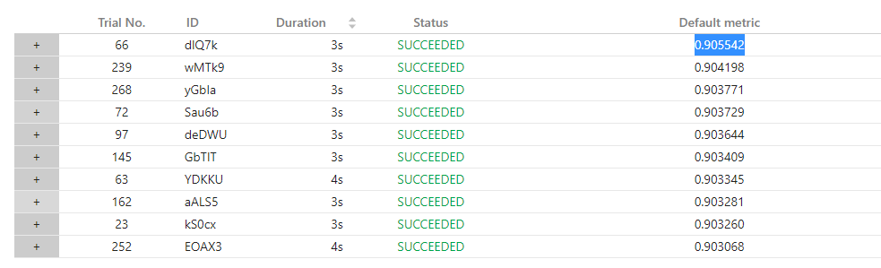
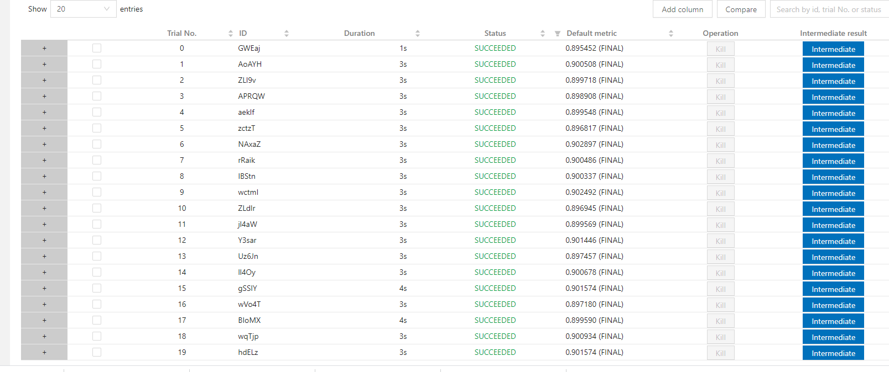

# Task 1.3.2 NNI Feature Engineering 任务2
## 队伍：pyboys
## 1. 任务概述
自选一个二分类数据集，进行Binary-classification benchmarks实验，比较baseline accuracy与automl accuracy
## 2. 环境配置
详见Task 1.3.1
## 3. 数据集简介
我们选取了UCI数据集中的[Bank Marketing Data Set](http://archive.ics.uci.edu/ml/datasets/Bank+Marketing)作为数据集进行实验，该数据集的基本情况如下表所示：
|Data Set Characteristics:|Number of Instances:|Area:|Attribute Characteristics:|Number of Attributes:|Date Donated|Associated Tasks:|Missing Values?|Number of Web Hits:|
|---|---|---|---|---|---|---|---|---|
|Multivariate|45211|Business|Real|17|2012-02-14|Classification|N/A|1215670
## 4. Search Space
我们选取了数据集中的一些数值特征和类别特征进行feature exploration and feature selection， Search Space如下：
```json
{
    "count":[
        "job","marital","education","default","housing","contact","loan","poutcome"
    ],
    "aggregate":[
        ["age","balance","duration","pdays"],
        [
            "job","marital","education","default","housing","contact","loan","poutcome"
        ]
    ],
    "crosscount":[
        [
            "job","marital","education","default","housing","contact","loan","poutcome"
        ],
        [
            "job","marital","education","default","housing","contact","loan","poutcome"
        ]
    ]
}
```
## 5. 实验结果
我们将```maxTrialNum```和```maxExecDuration```分别设置为2000和1小时，在一小时内总共完成了271个trial，其中baseline的准确率为	0.895452，搜索到的最优参数组合的准确率为0.905542，如下图所示：


|  Dataset   | baseline auc  | automl auc | number of cat|  number of num |  dataset link| 
|  ----  | ----  | ----  | ----  |  ----  | ----  | 
| Bank| 0.8954 | 0.9055 | 9 | 7| [data link](http://archive.ics.uci.edu/ml/datasets/Bank+Marketing) |